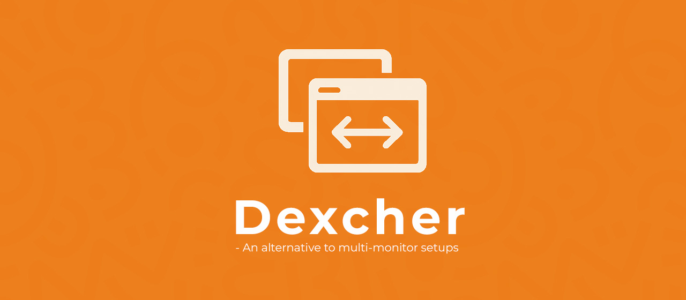
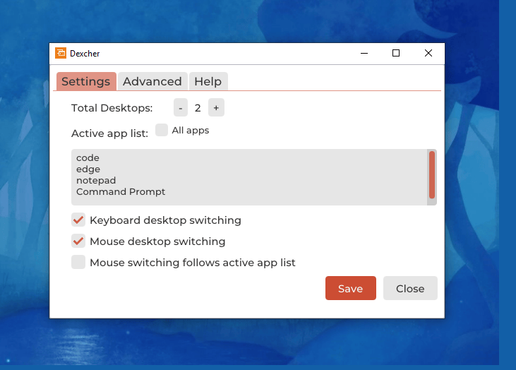

>)

## 🚀 Overview

Dexcher is an **alternative to multi-monitor setups**.
It helps users manage multiple desktops conveniently, with a focus on speed and simplicity.

## ✨ Features

- **Mouse Switching**: Switch desktops by moving mouse to left/right edges of the display
- **Keyboard Switching**: Press _ESC_ key to switch desktops
- **Active app list**: Desktop switching occurs only if the currently active app is in this list.

## 🖥️ Installation

1. Download the latest release from [Releases](https://github.com/nimsara-c/dexcher/releases).
2. Run the installer (`.exe` file).
3. Follow the on-screen instructions.

## 📂 Usage

- _ESC_ key - Switch desktops only when the current application is in the _active app list_ or _all_ apps selected.
- Adjust other settings accordingly in the configuration menu.

## 📜 License

This project is licened under [MIT Licence](LICENSE.txt)
